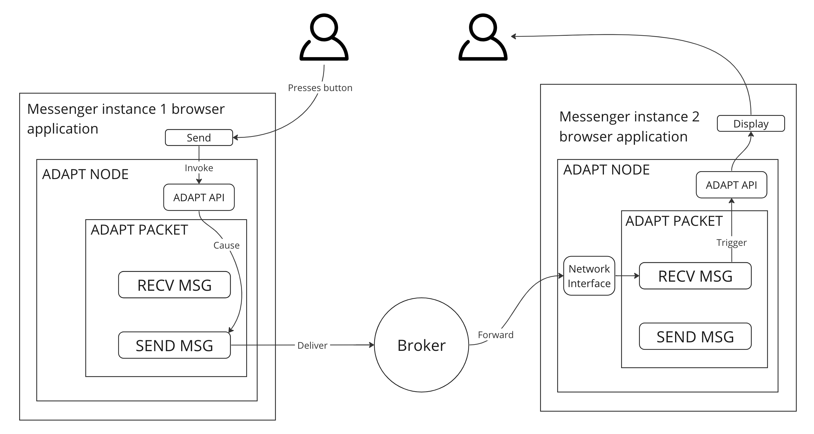

# ADAPT Messenger Demo

This repository contains a demo project built using ADAPT: a simple browser-based no-back-end messenger with end-to-end encryption. This example demonstrates how messages can be broadcast securely, with each recipient in a group chat receiving a uniquely encrypted message, all achieved with just a few lines of MUFL code.

A [detailed tutorial](https://docs.adaptframework.solutions/release/0.2/messenger-tutorial-1.html) provides a step-by-step walkthrough for this demo.

Using the messenger functionality as an example, this repository shows the capabilities of the ADAPT framework and MUFL. It demonstrates how the framework can be used to build decentralized applications. 

Navigate through the sections for an in-depth look:

0. [About ADAPT Framework](#about-adapt-framework)
1. [Messenger Architecture](#messenger-architecture)
2. [Code Structure](#code-structure)
3. [How to Build](#how-to-build)
4. [ADAPT Architecture](#adapt-architecture)

You can try this demo in [interactive codesandbox](https://codesandbox.io/p/github/adapt-toolkit/adapt-hello-world-example/release-0.2?file=/.codesandbox/README.md:1,1).

### **About ADAPT Framework**

The ADAPT Framework is used to build a mesh of interconnected data nodes that underlies a new type of an internet application. The mesh serves the role of the back-end (data layer) of the application, while being distributed between front-end and (possibly) server nodes, potentially belonging to multiple parties. The goal of this architecture is to build applications for higher degree of security and trust. 

The framework eliminates the traditional REST-based web back end and instead distributing the data, and building front-end-only and non-custodial applications. The ADAPT's approach is especially suitable for handling sensitive, critical, or proprietary data, where the traditional web architecture cannot be made sufficiently secure. 

ADAPT-based nodes run identically on the client side and server side of the application. The nodes self-host the back-end business logic of the application and are connected into a data mesh. Each node is a request-response server that manages a set of data belonging to the node, termed a "packet". Every request to the node results in a state transition of its data packet. 

MUFL Programming Language is used to implement the state transitions of packets. It is a functional special-purpose programming language designed to enable easy use of cryptography, simplify data manipulation, and perform secure communication within the data mesh. 

You can find more information in our documentation:
- **General:** [ADAPT Framework Documentation](https://docs.adaptframework.solutions/)
- **MUFL Overview:** [Detailed MUFL Documentation](https://docs.adaptframework.solutions/basic-syntax.html)
- **Beginner's Guide:** [ADAPT Tutorial](https://docs.adaptframework.solutions/detailed-build-example.html)

You can also find the ADAPT whitepaper, information about our team and other links on [our main site](https://www.adaptframework.solutions/).

Feel free to join our [discord server](https://discord.gg/VjKSBS2u7H) and ask all your questions! With love, ADAPT team <3

### **Messenger Architecture**

The ADAPT messenger demo implements a serverless architecture for a bare-bones messaging application. Messages are exchanged directly between the front-end nodes that belong to individual users. 

The following image shows the way a message propagates through the application's data mesh, consisting of two nodes that belong to two users that are messaging each other. 



As shown in the drawing, once User 1 presses the "SEND" button, the React UI calls ADAPT API, which triggers a "Send message" transaction on the locally-managed ADAPT packet. After the completion of the associate state transition of the packet, a message addressed to User 2 is sent to the broker, which then forwards it to the second user's ADAPT node. This triggers a state transition in the second user's ADAPT packet, according to the "receive message" transaction. The result of that transaction is an event sent via the ADAPT api to React, causing the message to be displayed in the user's browser window. 

In group channels, messages are broadcast, that is they are simultaneously dispatched to every other member of the group. Each message is encrypted using a distinct encryption key.

> **Example:** If a chat consists of 10 members and one of them sends a message, that message is encrypted using 9 unique keys for the 9 other members. These encrypted messages are then sent out individually to each member.

Joining a chat requires an invite code from an existing member who serves as the group's admin. This code carries a transient encryption key used only once during the initial key exchange. After the key exchange, members can exchange encrypted messages. The inviter/admin also ensures that all members of the chat are introduced to each newcomer, facilitating an exchange of encryption and signing keys.

The extensive encryption, key exchange, and signing mechanisms discussed above are trivially implemented using features of ADAPT. These features simplify the development process substantially. This demo is designed to illustrate features of ADAPT and is not designed for production use. If you feel drawn to take this messenger project further (someone should!), please ping us in Discord. We are especially interested to collaborate with someone on completing this project into a form of a fully embeddable, customizable and interoperable messenger infrastructure. 

For a more exhaustive understanding of ADAPT, MUFL, and this demo, consult our [detailed tutorial](https://docs.adaptframework.solutions/release/0.2/messenger-tutorial-1.html), which walks you through the demo's development and deep-dives into MUFL code.

### **Code Structure**

```
|-- compile-mufl-code-in-docker.sh # this script allows you 
|                                    to compile your local
|                                    MUFL code using ADAPT 
|                                    docker development kit
|
|-- docker-compose.yml             # docker compose configuration of the demo.
|                                    it contains 2 docker containers -- broker and web
|
|-- Dockerfile                     # Dockerfile containing instructions how 
|                                    how to create a docker image          
|
|-- LICENSE                        # ADAPT license
|
|-- README.md                      # You are reading this file now!
|
|-- mufl_code                      # Directory containing all the MUFL code
|   |
|   |-- actor.mu                   # Main MUFL application implementing 
|   |                               the business logic of the messenger 
|   |
|   |-- config.mufl                # MUFL config file specifiying a path
|   |                                to the MUFL standard library
|   |
|   \-- <...>.muflo                # Compiled MUFL code
|
\-- web                            # Directory containing frontend code.
                                     For details, please refer to the source code
```


### **How to build**

To get the ADAPT messenger demo up and running, first, construct a Docker image. Then, use the docker-compose utility to initiate the containers.

```bash
docker build . -t messenger-demo # build docker image

docker-compose up -d # run docker containers

open http://localhost:8080 # open a browser tab
```

To shut down the demo, execute:

```
docker-compose down
```

If there's any modification to the MUFL code, recompilation is necessary. This can be achieved effortlessly using the compile-mufl-code-in-docker.sh script.

```bash 
./compile-mufl-code-in-docker.sh
```

Once recompiled, the frontend application will utilize this updated version automatically.

### **ADAPT Architecture**

In the context of this messenger demo, the architecture of ADAPT consists of two main components: the browser user's node and the message broker.

1. **Browser User's Node**: This node managers the user's ADAPT packet, which hosts the chat's entire business logic. The browser node supervises the user's packet, processes requests (transactions) within the packet, and stores the packet's new state post-transaction. All of these operations leverage the ADAPT JS API —- a set of TypeScript functions that enable the JS/TS web front-end to drive the execution of the MUFL code over the data embedded within the node. In browser environments, the ADAPT JS API runs on top of a WebAssembly (WASM) module, whereas in native environments, it drives a native NodeJS addon.

   > For a comprehensive understanding of the ADAPT JS API, visit our [documentation](https://docs.adaptframework.solutions/release/0.2/api-reference.html).

2. **Message Broker**: Within the MUFL code, inter-node communication is guided by packet IDs. The message broker's role is to associate these packet IDs with the actual IP addresses of the nodes. Notably, in this demo, every message that traverses the message broker is encrypted, although this is contingent on the MUFL-based application logic. Consequently, even in scenarios where the message broker's integrity is compromised, the attacker cannot glean any sensitive information.

Outlined below is the three-step communication process between any two nodes:

1. Packet A submits a registration request to the broker. In response, the broker correlates the requesting packet's ID with its actual IP address.
2. Packet B replicates the aforementioned registration process.
3. Packet A dispatches a message intended for Packet B via the message broker. The broker retrieves Packet B's IP address and routes the message accordingly.

A standout feature of ADAPT is its abstraction of the underlying communication mechanisms, allowing MUFL developers to focus exclusively on building the application's business logic and facilitating node communication. 
